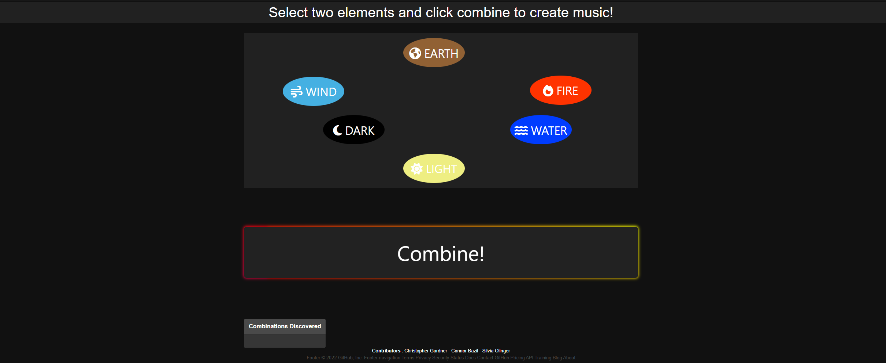
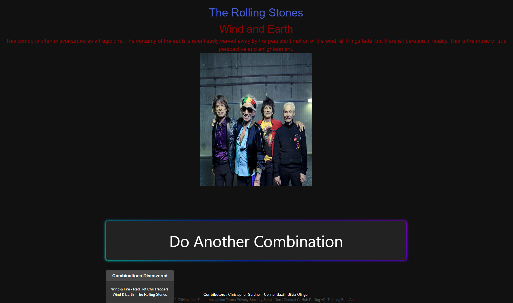

# MusicCombo

## Description

Our objective is to create a simple application that uses two different elements to create a combination that reveals a music artist. The guidelines of the project dictate that we follow certain criteria, such as the implementation of a new CSS framework (Bulma) and the use of two or more APIs. 

## User Story

* **AS** a music enthusiast and gamer
* **I WANT** an interactive and unique way to discover new artists
* **SO THAT** I can enjoy the process of finding fresh music

## Screenshots

* Home/Elements Page

* Result Page

## Technologies Used

* Bulma CSS Framework
* CSS
* JavaScript
* Font Awesome
* Spotify API (RapidAPI)
* YouTube API (RapidAPI)

## Contributers
* Christopher Gardner
* Connor Bazil
* Silvia Olinger

## Screen Shot

## Repo Link
https://github.com/Moresoups/MusicCombo/blob/main/README.md

## Website Link

