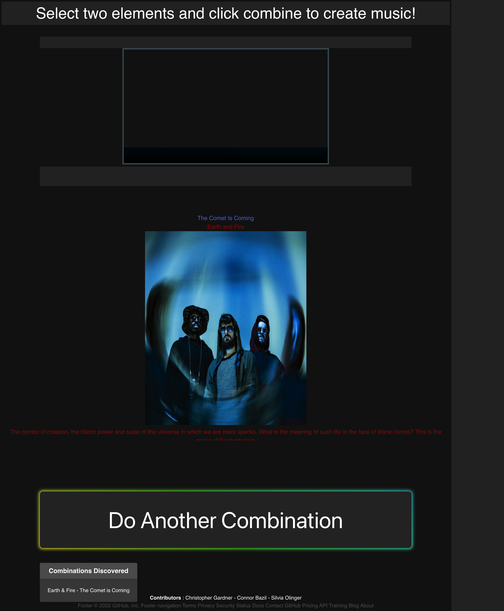

# MusicCombo

## Description

Our objective is to create a simple application that uses two different elements to create a combination that reveals a music artist. The guidelines of the project dictate that we follow certain criteria, such as the implementation of a new CSS framework (Bulma) and the use of two or more APIs. 

The page displays six "Element" buttons that a user is asked to select and click two of said buttons to create music. Beneath the six buttons is a much larger button that reads "Combine!" Once a user has selected their two choices, they hit combine to execute the operation to find and create both a YouTube video, and Spotify information on a band that they may or may not have heard of before. 

The user will also be able to see which combinations they have already attempted in the "Combinations Discovered" box at the bottom of the screen. The interface is simple and clean, allowing a user to easily navigate the functionality of the application. 

## User Story

* **AS** a music enthusiast and gamer
* **I WANT** an interactive and unique way to discover new artists
* **SO THAT** I can enjoy the process of finding fresh music

## Screenshots/Steps

* Home/Elements Page

The homepage, as mentioned in the description, presents a user with six element buttons and a large "Combine!" button, along with some footer information and a card for combinations discovered. To get started, a user will follow the prompt at the top of the screen - "Select two elements and click combine to create music!" So, lets click one and see what happens. 

* First Button Pressed

When you click the first button, in this example "Earth," the button disappears. This keeps the user from clicking the same element again, which would result in an error. Now let's click our second element. 

* Second Button Pressed

When you click a second button, for example "Fire," all buttons are hidden except for the "Combine!" button so that users do not attempt to add additional elements, which would cause an error since these are only two element combinations. Now, time to combine our stuff!

* Combine/Result Page

When you click "Combine!," the application pulls from the YouTube and Spotify APIs, displaying a YouTUbe video player (top square; works but not appearing in screenshot) and band info and image below it. There is also an option to "Do Another Combination" and a card that holds all the combinations attempted. Since the example is Earth and Fire, it catalogs a string that says the combination and band - "Earth & Fire - The Comet is Coming." 

* Do Another Combination Page

When you click "Do Another Combination" it returns you to the original series of buttons. However, the saved combinations persist. Now, lets find some more music! 

## Technologies Used

* Bulma CSS Framework
* CSS
* JavaScript
* Font Awesome
* Spotify API (RapidAPI)
* YouTube API (RapidAPI)

## Contributers
* Christopher Gardner
* Connor Bazil
* Silvia Olinger

## Screenshots

## Repo Link
https://github.com/Moresoups/MusicCombo/blob/main/README.md

## Website Link
https://moresoups.github.io/MusicCombo/
